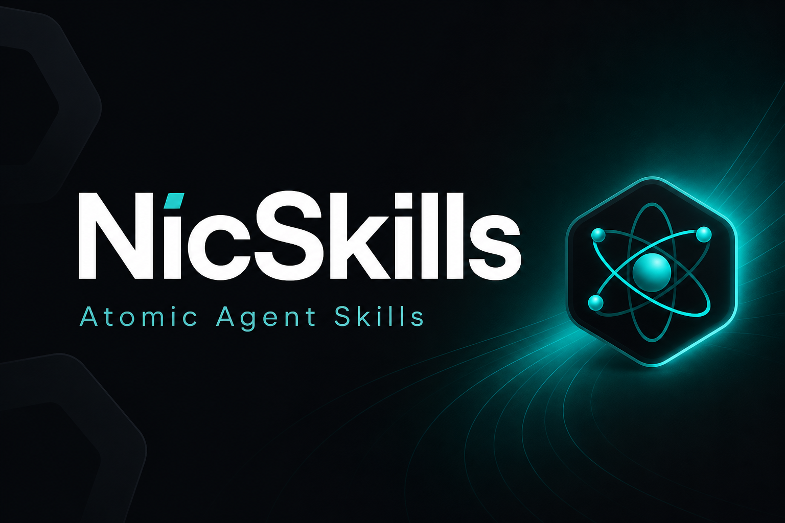
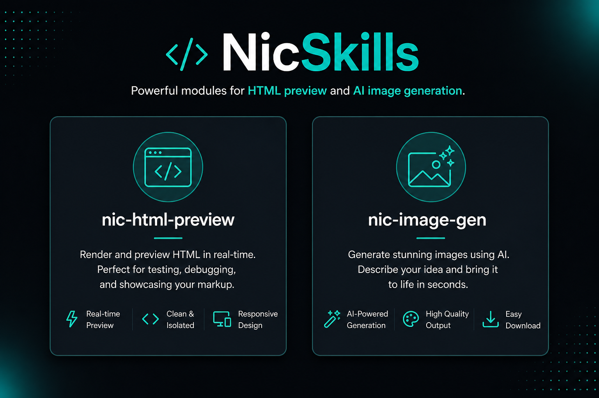
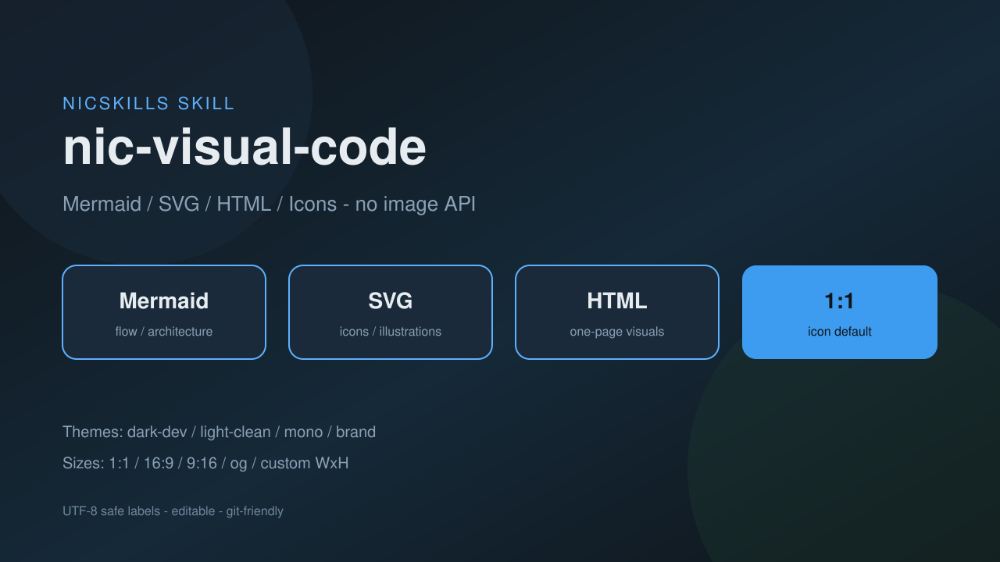
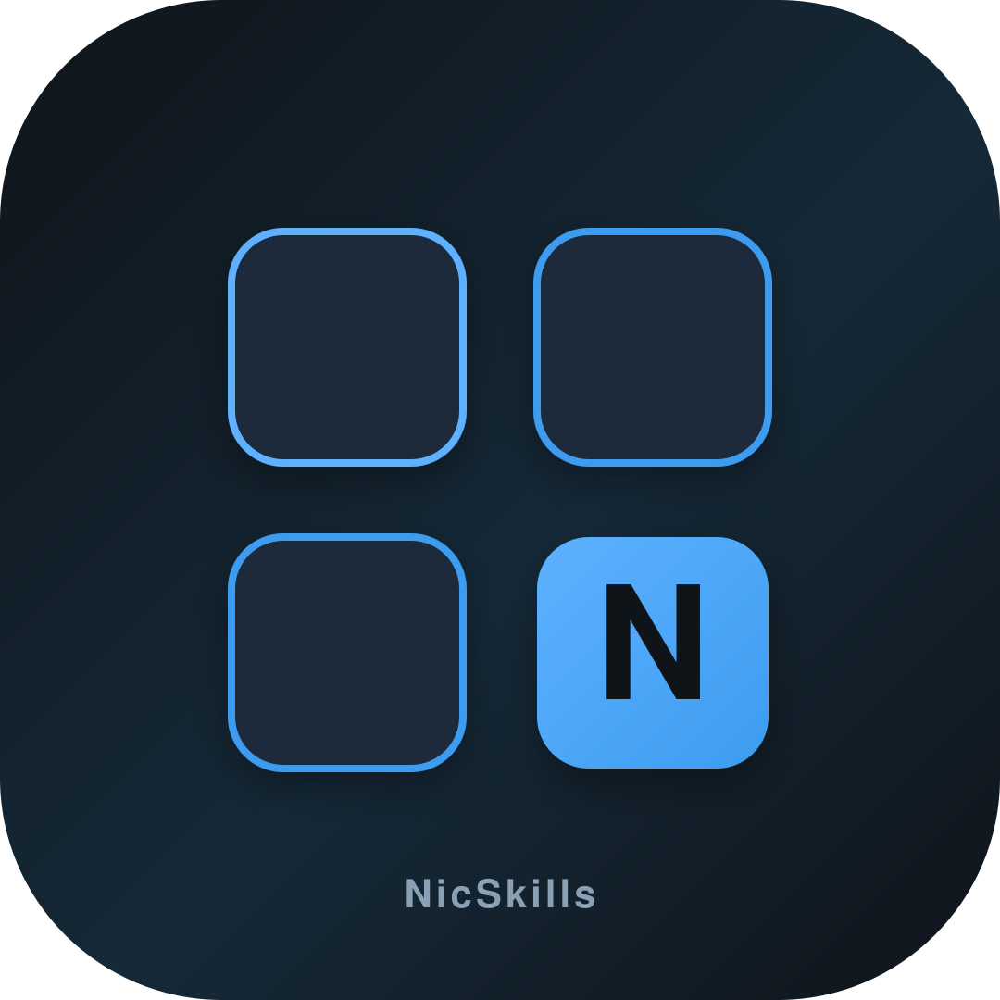
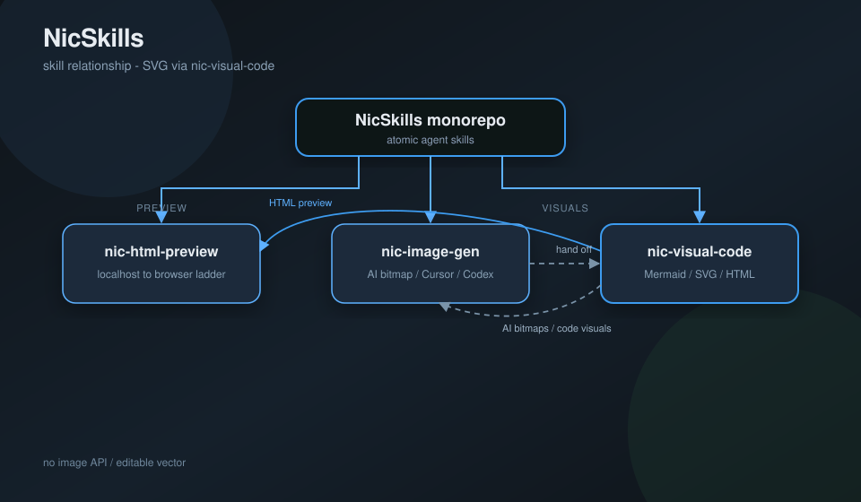
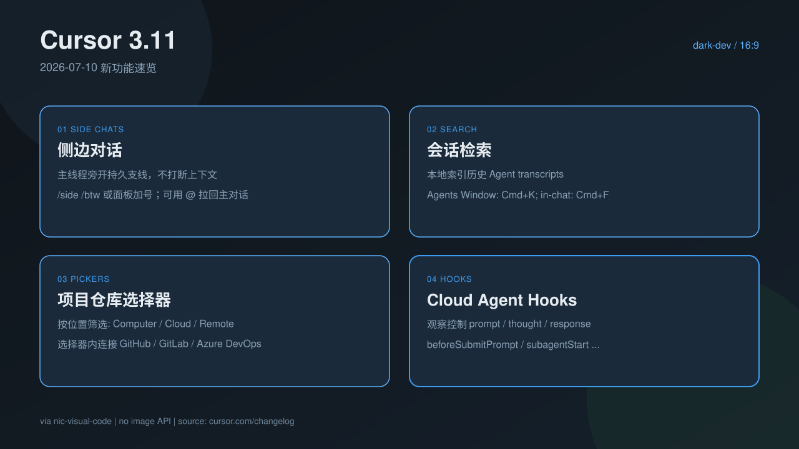
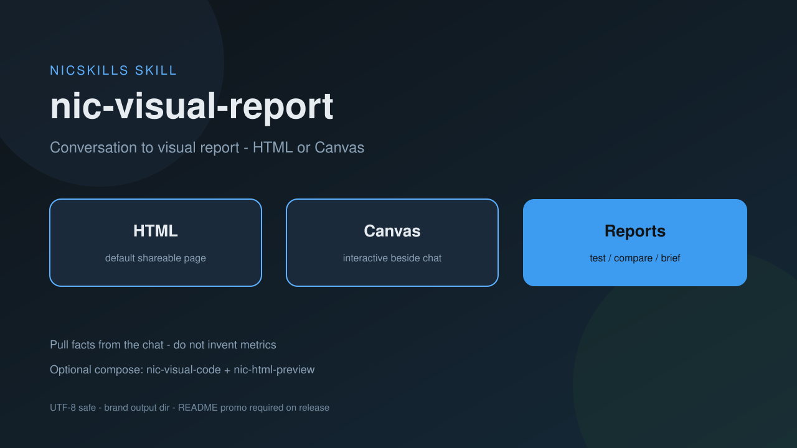
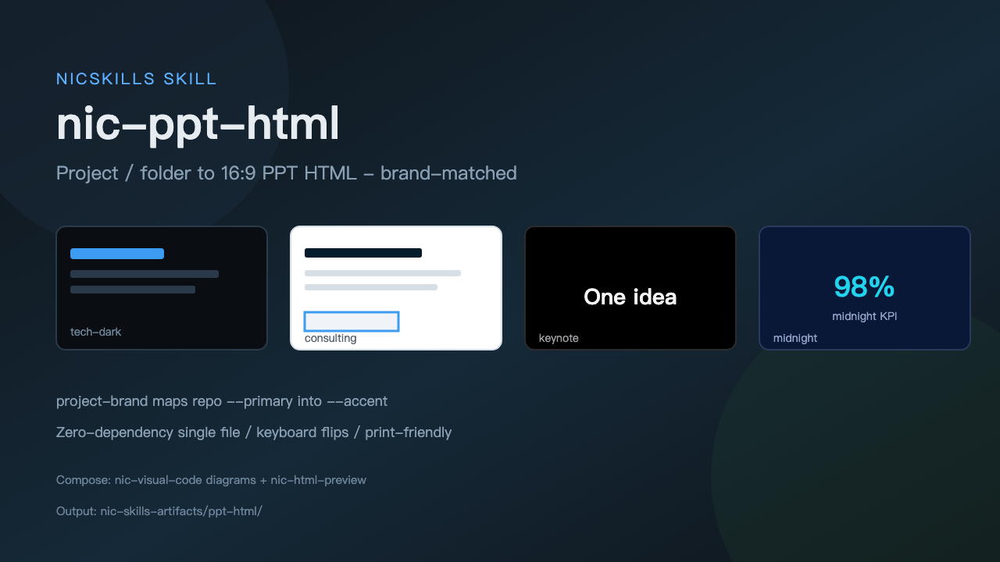
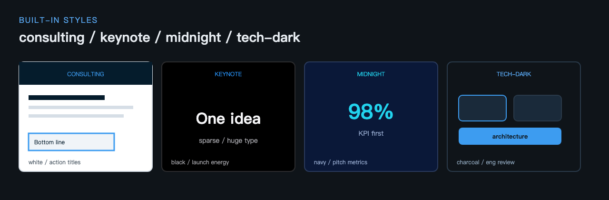

# NicSkills

Atomic Agent Skills for **developer tooling** — script-first, dogfood-first, install on demand.

> Prefix: `nic-` · Positioning: [PROJECT.md](./PROJECT.md)

**Language:** [English](./README.md) | [中文](./README.zh.md)





## Skills

| Skill | Status | What it does |
|-------|--------|----------------|
| [`nic-html-preview`](./skills/nic-html-preview/) | 0.2.1 | Serve local `.html` over localhost; open via Cursor / browser MCP / system browser (adaptive) |
| [`nic-image-gen`](./skills/nic-image-gen/) | 0.1.2 | Route AI bitmap gen to Cursor `GenerateImage` or Codex `$imagegen` → `nic-skills-artifacts/image-gen/` |
| [`nic-visual-code`](./skills/nic-visual-code/) | 0.1.4 | Mermaid / SVG / HTML visuals + icons (no image API); size/theme + no-mojibake → `nic-skills-artifacts/visual-code/` |
| [`nic-visual-report`](./skills/nic-visual-report/) | 0.1.1 | Conversation → visual report (HTML/Canvas); language follows user context |
| [`nic-ppt-html`](./skills/nic-ppt-html/) | 0.1.0 | Project/folder → 16:9 PPT HTML deck; brand-matched styles for exec/architecture reporting |

## Featured: `nic-visual-code`

Code-based visuals **without** image-generation APIs — editable, UTF-8 safe, git-friendly.



**What it can do**

| Capability | Default | Notes |
|------------|---------|--------|
| Mermaid diagrams | structural charts | flow / architecture / sequence |
| SVG illustrations | vectors | posters, maps, feature boards |
| SVG icons | `1:1` · 1080×1080 | app icon / favicon / monogram |
| HTML one-pagers | `16:9` slides | preview with [`nic-html-preview`](./skills/nic-html-preview/) |
| Themes | `dark-dev` | also `light-clean` / `mono` / `brand` |
| Sizes | `16:9` or `1:1` | also `9:16` / `og` / custom `WxH` |

Install:

```bash
npx skills add nickylin/NicSkills --skill nic-visual-code
```

### Examples

**Icon** (`1:1` SVG)



**Skill map** (SVG diagram)



**Feature board** (Cursor 3.11 / July 2026, `16:9`)



More detail: [`skills/nic-visual-code/SKILL.md`](./skills/nic-visual-code/SKILL.md)

## Featured: `nic-visual-report`

Turn the **current conversation** into a visual report — test results, solution outcomes, tech comparisons, or session briefs. Default **HTML**; optional **Cursor Canvas**.



| Mode | Deliverable |
|------|-------------|
| `html` (default) | `nic-skills-artifacts/visual-report/html/*.html` |
| `canvas` | `.canvas.tsx` beside chat |

```bash
npx skills add nickylin/NicSkills --skill nic-visual-report
```

More detail: [`skills/nic-visual-report/SKILL.md`](./skills/nic-visual-report/SKILL.md)

## Featured: `nic-ppt-html`

Turn a **project or folder** into a **16:9 PPT-style HTML** deck for architecture briefs, exec updates, or product narratives. Matches project theme colors when possible; ships built-in `consulting` / `keynote` / `midnight` / `tech-dark` skeletons.



**Built-in styles**



| Style | Best for |
|-------|----------|
| `project-brand` (default) | Accent from repo CSS / tokens |
| `consulting` | Decision / board decks |
| `keynote` | Sparse launch slides |
| `midnight` | KPI / pitch energy |
| `tech-dark` | Engineering reviews |

```bash
npx skills add nickylin/NicSkills --skill nic-ppt-html
```

Demo deck (keyboard ← →): [`skills/nic-ppt-html/examples/demo-deck.html`](./skills/nic-ppt-html/examples/demo-deck.html) — preview with [`nic-html-preview`](./skills/nic-html-preview/).

More detail: [`skills/nic-ppt-html/SKILL.md`](./skills/nic-ppt-html/SKILL.md)

## Install (local / dogfood)

```bash
# Cursor personal skills (examples)
ln -sfn "$(pwd)/skills/nic-html-preview" ~/.cursor/skills/nic-html-preview
ln -sfn "$(pwd)/skills/nic-image-gen" ~/.cursor/skills/nic-image-gen
ln -sfn "$(pwd)/skills/nic-visual-code" ~/.cursor/skills/nic-visual-code
ln -sfn "$(pwd)/skills/nic-visual-report" ~/.cursor/skills/nic-visual-report
ln -sfn "$(pwd)/skills/nic-ppt-html" ~/.cursor/skills/nic-ppt-html
```

Or:

```bash
npx skills add nickylin/NicSkills --skill nic-html-preview
npx skills add nickylin/NicSkills --skill nic-image-gen
npx skills add nickylin/NicSkills --skill nic-visual-code
npx skills add nickylin/NicSkills --skill nic-visual-report
npx skills add nickylin/NicSkills --skill nic-ppt-html
```

Prefer **single-skill** install. Full-repo install loads more context than you need.

## Design principles

1. One skill, one job
2. Deterministic logic lives in `scripts/` when needed; routers can be instruction-only
3. Keep `SKILL.md` lean
4. Use it yourself before open-sourcing

## License

MIT (planned — LICENSE file lands before public release)
