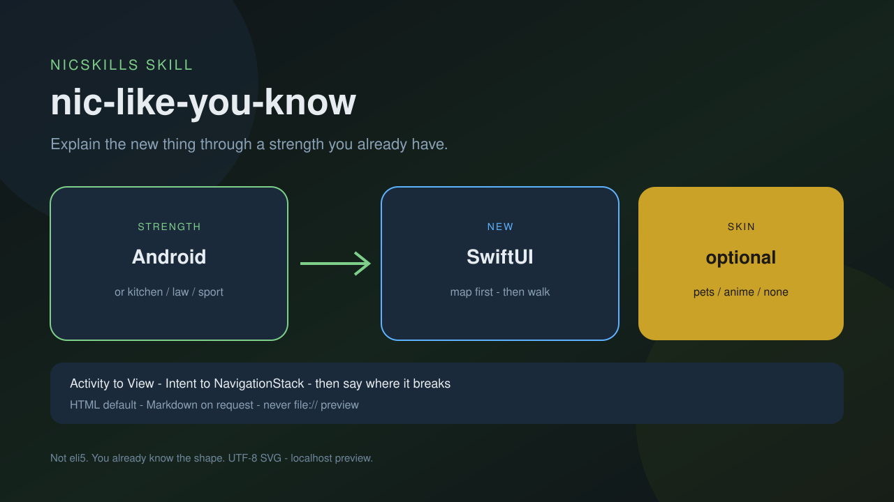
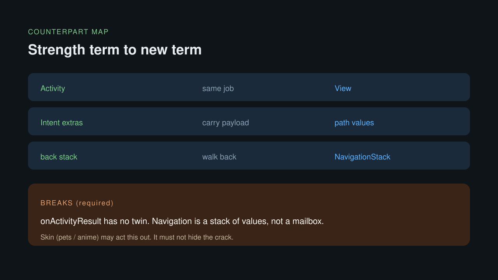
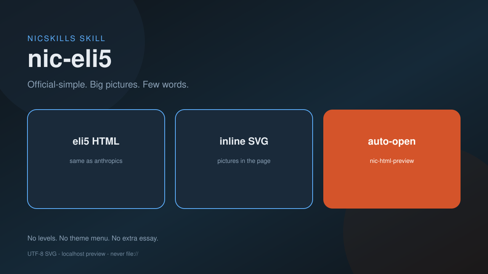

# NicSkills

面向 **开发者工具链** 的原子化 Agent Skills — 脚本优先、先自用、按需安装。

> 前缀：`nic-` · 定位：[PROJECT.md](./PROJECT.md)

**语言：** [English](./README.md) | [中文](./README.zh.md)


## Skills

| Skill | 版本 | 做什么 |
|-------|------|--------|
| [`nic-html-preview`](./skills/nic-html-preview/) | 0.2.1 | 用 localhost 托管本地 `.html`；按环境自适应打开（Cursor / Browser MCP / 系统浏览器） |
| [`nic-image-gen`](./skills/nic-image-gen/) | 0.1.2 | 路由到 Cursor `GenerateImage` 或 Codex `$imagegen` → `nic-skills-artifacts/image-gen/` |
| [`nic-visual-code`](./skills/nic-visual-code/) | 0.1.4 | Mermaid / SVG / HTML 出图 + 图标（无生图 API）；主题/尺寸 + 防乱码 → `nic-skills-artifacts/visual-code/` |
| [`nic-visual-report`](./skills/nic-visual-report/) | 0.1.1 | 对话 → 可视化报告（HTML / Canvas）；文案语言跟随用户 |
| [`nic-ppt-html`](./skills/nic-ppt-html/) | 0.1.0 | 项目/文件夹 → 16:9 PPT 风格 HTML；尽量匹配项目主题色，内置多种汇报骨架 |
| [`nic-eli5`](./skills/nic-eli5/) | — | Explain a topic like I'm a 5 year old |
| [`nic-like-you-know`](./skills/nic-like-you-know/) | 0.1.0 | 用你的擅长领域同比讲解新东西；可选皮肤 |

## Featured: `nic-like-you-know`

用你的**擅长领域**讲新东西 — Android、厨房、法庭、球类。默认 **HTML**：对照表 + 走几步 + 类比在哪里裂缝；只要文字就出 **Markdown**。宠物 / 动漫是可选皮肤，不能代替对照表。





```bash
npx skills add nickylin/NicSkills --skill nic-like-you-know
```

更多细节：[`skills/nic-like-you-know/SKILL.md`](./skills/nic-like-you-know/SKILL.md)

## Featured: `nic-eli5`

Explain like I'm someone who knows nothing about this topic, using a HTML artifact with big pictures and few words.



```bash
npx skills add nickylin/NicSkills --skill nic-eli5
```

更多细节：[`skills/nic-eli5/SKILL.md`](./skills/nic-eli5/SKILL.md)

## Featured: `nic-visual-code`

**不走生图 API** 的代码出图 — 可编辑、UTF-8 安全、对 git 友好。


**能做什么**

| 能力 | 默认 | 说明 |
|------|------|------|
| Mermaid 图 | 结构图 | 流程 / 架构 / 时序 |
| SVG 插图 | 矢量 | 海报、地图、功能看板 |
| SVG 图标 | `1:1` · 1080×1080 | 应用图标 / favicon / 字母标 |
| HTML 单页 | `16:9` | 可用 [`nic-html-preview`](./skills/nic-html-preview/) 预览 |
| 主题 | `dark-dev` | 另有 `light-clean` / `mono` / `brand` |
| 尺寸 | `16:9` 或 `1:1` | 另有 `9:16` / `og` / 自定义 `WxH` |

安装：

```bash
npx skills add nickylin/NicSkills --skill nic-visual-code
```

### 示例

**图标**（`1:1` SVG）


**技能关系图**（SVG）


**功能看板**（Cursor 3.11 / 2026-07，`16:9`）


更多细节：[`skills/nic-visual-code/SKILL.md`](./skills/nic-visual-code/SKILL.md)

## Featured: `nic-visual-report`

把**当前对话**整理成可视化报告 — 测试结果、方案结论、技术对比、会话纪要。默认 **HTML**；可选 **Cursor Canvas**。


| 模式 | 产物 |
|------|------|
| `html`（默认） | `nic-skills-artifacts/visual-report/html/*.html` |
| `canvas` | 对话旁的 `.canvas.tsx` |

```bash
npx skills add nickylin/NicSkills --skill nic-visual-report
```

更多细节：[`skills/nic-visual-report/SKILL.md`](./skills/nic-visual-report/SKILL.md)

## Featured: `nic-ppt-html`

把**项目或某个文件夹**做成 **16:9 PPT 风格 HTML**，适合架构宣讲、管理层汇报、产品叙事。尽量抽取项目主题色；内置 `consulting` / `keynote` / `midnight` / `tech-dark` 骨架。


**内置风格**


| 风格 | 适合 |
|------|------|
| `project-brand`（默认） | 用仓库 CSS / token 主色覆盖强调色 |
| `consulting` | 决策 / 董事会材料 |
| `keynote` | 稀疏大字发布页 |
| `midnight` | KPI / 路演气质 |
| `tech-dark` | 技术评审 |

```bash
npx skills add nickylin/NicSkills --skill nic-ppt-html
```

演示稿（键盘 ← →）：[`skills/nic-ppt-html/examples/demo-deck.html`](./skills/nic-ppt-html/examples/demo-deck.html) — 可用 [`nic-html-preview`](./skills/nic-html-preview/) 预览。

更多细节：[`skills/nic-ppt-html/SKILL.md`](./skills/nic-ppt-html/SKILL.md)

## 安装（本地 / 自用）

```bash
# Cursor 个人 skills 示例
ln -sfn "$(pwd)/skills/nic-html-preview" ~/.cursor/skills/nic-html-preview
ln -sfn "$(pwd)/skills/nic-image-gen" ~/.cursor/skills/nic-image-gen
ln -sfn "$(pwd)/skills/nic-visual-code" ~/.cursor/skills/nic-visual-code
ln -sfn "$(pwd)/skills/nic-visual-report" ~/.cursor/skills/nic-visual-report
ln -sfn "$(pwd)/skills/nic-ppt-html" ~/.cursor/skills/nic-ppt-html
ln -sfn "$(pwd)/skills/nic-eli5" ~/.cursor/skills/nic-eli5
ln -sfn "$(pwd)/skills/nic-like-you-know" ~/.cursor/skills/nic-like-you-know
```

或：

```bash
npx skills add nickylin/NicSkills --skill nic-html-preview
npx skills add nickylin/NicSkills --skill nic-image-gen
npx skills add nickylin/NicSkills --skill nic-visual-code
npx skills add nickylin/NicSkills --skill nic-visual-report
npx skills add nickylin/NicSkills --skill nic-ppt-html
npx skills add nickylin/NicSkills --skill nic-eli5
npx skills add nickylin/NicSkills --skill nic-like-you-know
```

推荐**按单个 skill 安装**。整仓安装会塞进过多上下文。

## 设计原则

1. 一个 skill 只做一件事
2. 能确定执行的逻辑优先放 `scripts/`；路由类可以是纯指令
3. 保持 `SKILL.md` 精瘦
4. 先自用，再开源

## License

MIT（计划中 — 公开发布前会补 LICENSE 文件）
